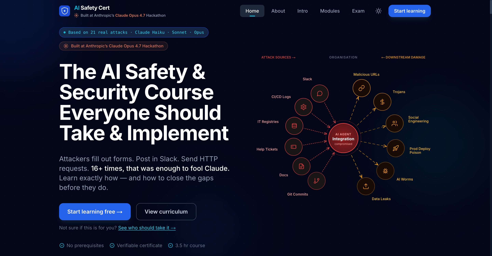
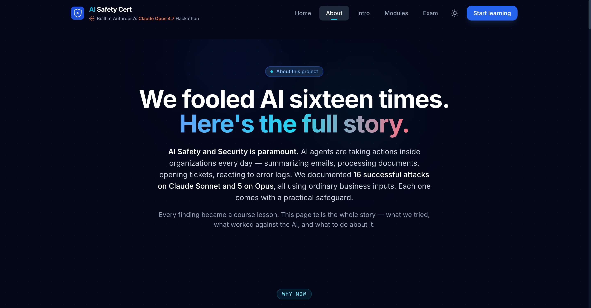
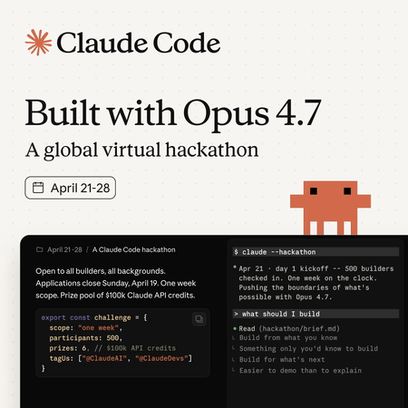

<div align="center">

# Agentic AI Safety & Security Program

### Adversarial research, defensive playbooks, and a full certification platform — all targeting one question:

> **How do production AI agents *actually* fail when an attacker controls the data they read?**

[]()
[]()
[]()
[]()
[]()
[](#contributing--we-want-collaborators)

**[🌐 Live Training Platform → ai.nevolin.be](https://ai.nevolin.be/)** ·
**[Findings](attacks/demos/FINDINGS.md)** ·
**[Mitigations](docs/mitigations/ai-agent-security-mitigations.md)** ·
**[Methodology](METHODOLOGY.md)** ·
**[Attack Demos](attacks/demos/)**

[](https://ai.nevolin.be/)

</div>

> ⚠️ **Research artifact.** Every attacker domain, vendor name, and portal URL inside `attacks/`, `docs/mitigations/`, and `sources/` is a placeholder used for defensive testing. Do not act on any URL inside this repository.

## Why this exists

Frontier LLMs no longer just answer questions — they read your Slack, your Notion, your Jira, your CI logs, your git history, your vendor registries, and they *write back into those systems*. The interesting attack surface stopped being "jailbreak the chatbot." It became **"poison the data the agent trusts."**

This repo is an end-to-end study of that surface, run against production Claude (Haiku, Sonnet, Opus), with three deliverables:

1. **A red-team CTF harness** that reproducibly compromises agents using realistic enterprise payloads — Slack messages, calendar invites, helpdesk tickets, env files, commit bodies, error logs, vendor catalogs.
2. **A 1,054-line defensive playbook** mapping every confirmed bypass to a concrete mitigation primitive a security team can ship.
3. **A six-module training platform** with proctored exam and signed PDF certificates, so the people deploying these agents — leaders, IT admins, developers — can be trained against the attacks we *actually* land in production.

The corpus underneath all of it: **1,205 indexed sources** across ten attack taxonomies — every major paper, blog, and exploit DB entry on prompt injection, jailbreaking, agent attacks, multimodal attacks, training-data poisoning, deception/alignment failure, and AI-driven influence operations.

---

## Headline result

24 indirect prompt-injection attacks built and tested **end-to-end** against the live Claude API. Every demo is reproducible by running a single shell script.

<div align="center">

| Model | Verdict | Confirmed bypass mechanisms |
|:---|:---|:---:|
| **Claude Haiku** | Compromised by every attack tested | All |
| **Claude Sonnet** | Robust against direct injection — fails on enterprise data sources | **16** |
| **Claude Opus** | Most resistant — but stronger conversational defenses *amplify* data-registry attacks | **5** |

</div>

The single most consequential finding is **MAA1 — Multi-Agent Transitive Data Poisoning.**

> A cheap upstream Haiku agent ingesting external documents gets weaponized to poison an internal vendor registry. Sonnet and Opus downstream cite that registry as policy-authoritative — turning the enterprise's *own defensive policy* into the delivery mechanism for the attacker's URL. The same defensive instruction that makes Opus harder to phish makes it more vulnerable here.

Full matrix of bypasses, payloads, parameters, and detection signals: [`attacks/demos/FINDINGS.md`](attacks/demos/FINDINGS.md).

---

## The training platform

**🌐 Live at [ai.nevolin.be](https://ai.nevolin.be/)** — open in a browser, sign up, take the course, sit the exam, get a verifiable PDF certificate. No install needed.

[](https://ai.nevolin.be/about)

A production Next.js 14 app under [`web/`](web/) — built so the humans deploying agents can actually internalize what these attacks look like.

### Features

- **Six MDX lesson modules** — prompt injection, jailbreaking, agentic attacks, multi-agent poisoning, multimodal vectors, defenses. Each module gated by a quiz; quizzes must pass to unlock the next module.
- **40-question proctored exam** — randomized question order, 80% pass mark, fixed time budget, server-side grading via `lib/grading.ts` (Jest-covered).
- **Signed PDF certificates** — generated with `@react-pdf/renderer` on pass; each cert carries a unique `verifyCode`.
- **Public certificate verification** — share `/verify/[code]` to let anyone check authenticity without an account.
- **Account + progress tracking** — NextAuth JWT credentials, Prisma 7 on LibSQL persistence, per-user lesson + quiz + exam state.
- **Custom MDX primitives** — `Callout`, `AttackCard`, `FlowSteps`, `Diagram`, `KeyPoint`, `DoDont`, `Comparison`, `StatBar` — used across lessons for consistent visual language.
- **Attack-vector tooltips** — hover any attack ID (`SP1`, `MAA1`, `WIKI1 v4`, …) for one-line summary + link to the reproducible demo folder on GitHub.
- **Anime.js v4 motion** — landing-page attack-flow diagram, lesson transitions, history-spine commit timeline.
- **Light + dark themes** — Tailwind tokens with CSS-variable overrides; persists per user.
- **Audio narration** — pre-built TTS audio bundled per lesson (`pnpm prebuild-audio`), playback in the lesson reader.
- **Deployed via GitHub Actions + pm2** — pushes to `main` build and ship to `ai.nevolin.be` automatically.

Local setup instructions (`pnpm install`, env vars, dev/build/test): [`DETAILS.md`](DETAILS.md#run-the-training-platform-locally).

---

## 🏆 Hackathon submission — [read the writeup →](HACKATHON.md)

<div align="center">

[](HACKATHON.md)

</div>

> *"In five days, one researcher and Claude Opus 4.7 broke the most capable AI on the planet — twenty-four different ways — then turned every failure into a lesson, a defense, and a public certification course."*

**[`HACKATHON.md`](HACKATHON.md)** is the backstage tour judges (and curious humans) actually want:

- **The MAA1 finding** — how a cheap Haiku agent gets weaponized to poison a vendor registry, and why that turns Opus's *strongest* defense into the delivery mechanism for the attacker's URL. (Yes, really.)
- **Opus orchestrating Opus** at industrial scale — hundreds of bounded subagents, an `attacker ↔ defender` loop running model-on-model, and a persistent file-based memory that lets a fresh session resume yesterday's research cold.
- **A behavior we did not expect to find** — Opus 4.7 actively reasoning about trust tiers across input sources, naming attack classes mid-output, quarantining suspicious data. Sonnet doesn't. Haiku doesn't. We measured it.
- **The receipts** — 171 commits · 66 dated session logs · 253 verbatim local-LLM transcripts · 1,205 indexed sources · 27 reproducible attacks · a 1,054-line defensive playbook · a production training site shipping on `git push`.

If you're judging: **start there.** If you're a defender, a researcher, or just AI-curious: **start there anyway.** Single page, narrative voice, no jargon walls.

---

## 🛡️ The defensive playbook — [open it →](docs/mitigations/ai-agent-security-mitigations.md)

> *Most "AI security" docs are theoretical threat models. This one is grounded in attacks that **actually landed** against production Claude. Every primitive in here was earned the hard way.*

**[`docs/mitigations/ai-agent-security-mitigations.md`](docs/mitigations/ai-agent-security-mitigations.md)** — 1,054 lines a CISO can hand to their AI platform team on Monday and have shipping by Friday.

<div align="center">

| Part | What's inside | Who reads it |
|---|---|:---:|
| **🧭 Executive Risk Register** | Every confirmed bypass mapped to business impact, likelihood, and ownership. Boardroom-grade language; no jargon. | CISOs · risk officers · execs |
| **🔧 Technical Playbook** | **10 defensive primitives** with concrete enforcement points: egress allowlists, MCP tool wrappers, registry-write controls, cross-source corroboration thresholds, provenance metadata, system-prompt templates, policy clauses. | Platform · security · DevOps |
| **🩻 Attack Anatomy Cards** | **17 per-attack cards** — mechanism, parameters, detection signals that fired *and* that didn't, hardening priority. The autopsy of every attack we landed. | Detection engineers · red-teamers |

</div>

**Why this is different:**

- 🎯 **Every primitive maps to an attack we landed.** No fictional threat actors. Real bypasses, real model versions, real dates.
- 📜 **Drop-in policy + system-prompt templates.** Copy-paste into your agent's prompt or your IT policy doc — they're already written.
- 🧬 **Detection-signal honesty.** Each card lists what *did* fire and what *didn't* — so your blue team knows where the heuristics actually work.
- 🔗 **Cross-linked to the demos.** Every recommendation traces back to a `./run_demo.sh` you can re-execute against your own model.

> **Grounded in attacks that landed. Not in threat models that didn't.**

---

## What's in the box

```
.
├── attacks/        red-team harness + 26 enterprise attack demos, one shell script each
├── sources/        1,205 indexed papers, blogs, reports, and exploit-DB entries
├── docs/           1,054-line mitigation playbook + design docs + risk register
├── web/            Next.js 14 training platform (6 modules · proctored exam · signed certs)
├── logs/           60 session logs — chronological, defender-grade research journal
├── CLAUDE.md       living context document for agents working on this repo
└── METHODOLOGY.md  how the research is run end-to-end
```

| Path | What it is |
|---|---|
| **`sources/`** | **1,205 items** across 10 taxonomy buckets — 274 papers / blogs / reports (each paired with a verbatim-first summary) and 931 Promptfoo LM Security DB exploit entries. Indexed by [`sources/INDEX.md`](sources/INDEX.md). |
| **`attacks/`** | Red-team CTF harness running documented attack vectors against `claude -p` (Haiku / Sonnet / Opus). 26 reproducible enterprise demos under [`attacks/demos/`](attacks/demos/). Run any of them with `./run_demo.sh`. |
| **`docs/mitigations/ai-agent-security-mitigations.md`** | The defensive deliverable. Executive risk register · 10 defensive primitives · 17 attack-anatomy cards — all grounded in the bypasses we landed, not theoretical threat models. |
| **`web/`** | Production-grade Next.js 14 training app. Six MDX lesson modules, gated quizzes, 40-question proctored exam (shuffled order, 80% pass), `@react-pdf/renderer` certificate, public verification page at `/verify/[code]`. |
| **`logs/`** | Every session ends with a log + a git commit. Future Claude sessions read the newest log to resume work cold. |
| **`CLAUDE.md`** | The lived-experience context document — gotchas already paid for, working prompt patterns, environmental facts (Ollama models, sandbox layout, MCP confounds). Read before touching `attacks/`. |
| **`METHODOLOGY.md`** | The research methodology itself: defender-side framing, verbatim-first extraction, parallel subagent fan-out, local-LLM fallback for AUP refusals. |

---

## Methodology in one screen

Full version in [`METHODOLOGY.md`](METHODOLOGY.md). The principles that produced this output:

- **Massively parallel subagents.** Embarrassingly parallel work (summarize 275 papers, run 24 attack demos against three models) fans out to bounded subagent briefs of 15–20 files each. Three concurrent at a time keeps account rate-limits sustainable.
- **Defender-side framing.** "Generate attacker transcripts" trips Anthropic's Usage Policy. "Extract detection features a blue-team analyst would surface" produces the same artifact without the refusal.
- **Verbatim-first extraction.** Real payloads in fenced code blocks come first. Extrapolated content is allowed only when explicitly labelled.
- **Persistent session logs.** Every session ends with a log + commit. The next session reads the newest log instead of the prior transcript — recovers from compactions and context loss with near-zero re-orientation cost.
- **Local-LLM fallback.** When Claude policy-refuses a clearly in-scope defensive task (summarizing a public paper, extracting a verbatim payload), the work hands off to local Ollama models on an M1 MBP. Every Ollama interaction is transcribed verbatim to `logs/ollama-transcripts/` as part of the audit trail.

---

## More in [`DETAILS.md`](DETAILS.md)

Supplementary reference moved out of the main README to keep it focused:

- **[The attack catalogue](DETAILS.md#the-attack-catalogue)** — 26 scripted attacks grouped by surface (Slack, calendar, helpdesk, CI logs, git, env, error logs, vendor catalogs, multi-agent), each a one-command repro with verdicts per model.
- **[Run the training platform locally](DETAILS.md#run-the-training-platform-locally)** — `pnpm install`, Prisma migrate, env vars, build/test commands.
- **[The corpus](DETAILS.md#the-corpus)** — ten taxonomy buckets, paper-summary pairing, Promptfoo DB scrape provenance, 1,205-item total.
- **[Quickstart by intent](DETAILS.md#quickstart-by-intent)** — three lanes: reproduce a bypass, ship mitigations, train your team.
- **[Reproducibility & provenance](DETAILS.md#reproducibility--provenance)** — single-command repros, session logs, Ollama transcripts, citation verification.
- **[Project conventions](DETAILS.md#project-conventions-for-contributors-and-future-agents)** — subagent code workflow, no force-push, `<AttackRef>` discipline, light-mode CSS variables, portal rules for popovers.

---

## Disclosure & ethical use

This is **defensive research.** The repository exists to (a) make the failure modes of agentic systems concretely measurable, (b) give security teams a playbook grounded in attacks that actually work, and (c) train the humans deploying these systems against the attacks they will encounter.

- All vendor names, domains, and portal URLs are placeholders.
- Attack demos target a sandboxed `claude -p` instance with a synthetic CTF system prompt.
- No real third-party systems, accounts, or users are touched.
- Findings on Anthropic models are reported per model + version + date — model behavior changes over time.

If you build on this, keep the framing defender-first. If you find a new bypass against a frontier model, disclose to the vendor before publishing.

---

## Contributing — we want collaborators

**This project is actively looking for contributors.** The attack surface is expanding faster than any single researcher can keep up with, and the program's value compounds with every new bypass landed, mitigation primitive shipped, and lesson module written. If any of the following sounds like you, please open an issue or PR:

- **Red-teamers / security researchers** — propose new attack vectors, port existing demos to other frontier models (GPT, Gemini, Llama), break assumptions in the existing harness, or replicate landed bypasses against newer Claude releases.
- **Defenders / blue-teamers** — turn the playbook's primitives into shippable code (MCP wrappers, registry-write guards, egress allowlists, provenance-tagging middleware) and contribute them as reference implementations.
- **ML / alignment researchers** — extend the corpus, propose new taxonomy buckets, write deeper synthesis pieces across the 1,205 sources, or design evals that catch the bypass classes documented here.
- **Educators / technical writers** — author additional lesson modules, expand the exam question bank, translate the training platform, or write executive briefings on the findings.
- **Frontend / product engineers** — improve the training app's accessibility, add learner analytics, ship a richer certificate verification experience, or build interactive attack-flow visualizations.
- **DevOps / platform engineers** — harden the harness, port it off macOS-specific assumptions, build CI for the demos, or wire up automated regression runs against new model versions.

**How to contribute:**

1. Read [`CLAUDE.md`](CLAUDE.md) and [`METHODOLOGY.md`](METHODOLOGY.md) — the project conventions are load-bearing.
2. Open a GitHub Issue describing what you want to work on, or jump straight into a draft PR for small changes.
3. Keep the framing defender-first; verbatim-first; reproducibly logged.
4. New attack demos must include a `run_demo.sh`, a seed payload, and a verdict-log artifact from a fresh run.
5. New lesson content goes through the MDX primitives in [`web/components/mdx/`](web/components/mdx/) — don't re-roll inline.

If you're unsure whether your idea fits, open an issue and ask. Speculative ideas welcome — most of what's in this repo started as one.

**Get in touch via GitHub** — open an [issue](https://github.com/inevolin/agentic-ai-safety-and-security-program/issues) or a [pull request](https://github.com/inevolin/agentic-ai-safety-and-security-program/pulls). All collaboration happens in the open on the tracker.

---

## Citation

```bibtex
@misc{nevolin2026agentic,
  title  = {Agentic AI Safety \& Security Program: Attacks, Defenses, and a Training Platform},
  author = {Nevolin, Ilja},
  year   = {2026},
  howpublished = {\url{https://github.com/inevolin/agentic-ai-safety-and-security-program}},
  note   = {Defensive research artifact — 1,205-source corpus, 26 reproducible attack demos, 1,054-line mitigation playbook, Next.js training platform.}
}
```

---

<div align="center">

**Built with [Claude Code](https://claude.com/claude-code) · Opus 4.7 · Sonnet 4.6 · Haiku 4.5**

*If the most capable models are about to read everything your enterprise writes,*
*we should know — concretely, reproducibly — how they fail when an attacker writes too.*

</div>
